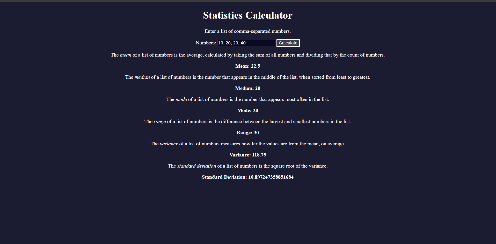

A simple, web-based application for performing statistical calculations such as mean, median, mode, range, variance, and standard deviation.

## Features

- Accepts a list of comma-separated numbers as input.
- Calculates:
  - **Mean**: Average of the numbers.
  - **Median**: Middle value in a sorted list.
  - **Mode**: Most frequently occurring number(s).
  - **Range**: Difference between the largest and smallest numbers.
  - **Variance**: Average squared deviation from the mean.
  - **Standard Deviation**: Square root of the variance.
- User-friendly interface with accessible design.
- Fully responsive and works in modern browsers.

## Technologies Used

- **HTML**: Structure of the application.
- **CSS**: Styling and layout.
- **JavaScript**: Logic for statistical calculations and interactivity.

## How to Use

1. Clone the repository:

   git clone https://github.com/Manusha-Nirmal-Perera/statistics-calculator.git

2. Open the index.html file in your web browser.

3. Enter a list of numbers separated by commas in the input field.

4. Click the Calculate button to compute the statistical metrics.

5. The results for mean, median, mode, range, variance, and standard deviation will be displayed below the input field.

# sample input
10, 20, 20, 40

# sample output

Mean: 22.5
Median: 20
Mode: 20
Range: 30
Variance: 118.75
Standard Deviation: 10.897247358851684

## Screenshot

